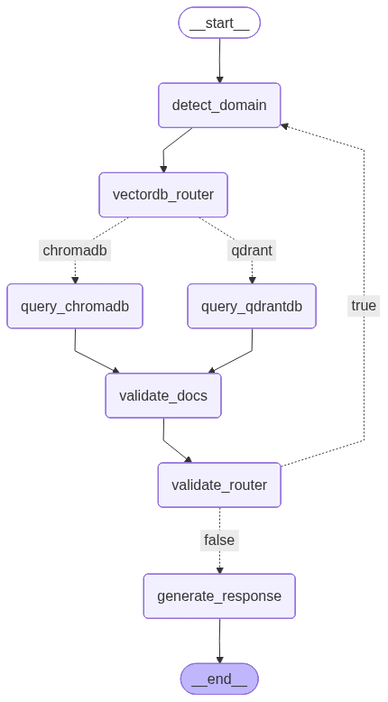

# 🤖📚 AgenticRAG

AgenticRAG is an intelligent **Retrieval-Augmented Generation (RAG)** system that uses an agentic architecture to dynamically manage multiple vector databases.  
It automatically routes data and queries across domains, validates retrieved context, and iteratively refines retrieval to generate accurate, context-rich responses.  
This project demonstrates **adaptive reasoning, automated data routing, and domain-aware knowledge retrieval**.

---

## ✨ Features

- 🧠 **LLM-Driven Decision Layer**  
  Automatically decides where to store and retrieve data based on content and query intent.

- 🏥 **Multi-Vector Database Architecture**  
  - **Qdrant** → Healthcare domain data  
  - **ChromaDB** → Engineering domain data  

- 🔍 **Validator Node**  
  Ensures retrieved context sufficiently answers the user query.

- 🔁 **Autonomous Re-Querying**  
  If validation fails, the system refines and re-runs retrieval automatically.

- ✍️ **Generator Node**  
  Produces accurate, context-rich responses using only validated information.

- 🧩 **Fully Agentic Pipeline**  
  No manual database selection required.

---

## 🧠 AgenticRAG Workflow
<p align="center">
  
</p>

---

## 🛠️ Tech Stack

| Component        | Technology Used              |
|------------------|------------------------------|
| 🐍 Programming   | Python                       |
| 🤖 LLM           | Groq (LLM Inference)         |
| 🔗 Agent Logic   | LangGraph + LangChain        |
| 📊 Vector DB     | Qdrant (Healthcare)          |
| 📊 Vector DB     | ChromaDB (Engineering)       |
| 🧠 Embeddings   | Sentence / MiniLM (384-dim)  |

---

## 📂 Project Structure

```text
AgenticRAG/
├── agent/
│   ├── ragGraph.py
├── config/
│   ├── config.py
├── llm_functions/
│   ├── classifier.py
│   ├── generator.py
│   ├── validator.py
├── vector_db/
│   ├── qdrant.py
│   └── chromadb.py
├── utils/
│   ├── file_reader.py
│   ├── text_embeddings.py
│   ├── text_splitter.py
│   ├── vectorstore.py
├── data/
├── requirements.txt
├── README.md
├── .env
```

---

## ⚙️ Installation & Setup (Using pip)

1. 📥 Clone the repository:
   ```bash
   git clone https://github.com/Sameer078/AgenticRAG
   cd AgenticRAG
   ```

2. 🧪 Create and activate a virtual environment:
   ```bash
   python -m venv venv
   source venv/bin/activate
   ```
   On Windows:
   ```bash
   venv\Scripts\activate
   ```

3. 📦 Install dependencies:
   ```bash
   pip install -r requirements.txt
   ```

4. 🔑 Set required environment variables:
   ```bash
   export GROQ_API_KEY="your_groq_api_key_here"
   export QDRANT_PATH="./qdrant_data"
   export QDRANT_COLLECTION="healthcare_docs"
   export CHROMADB_PATH="./chroma_data"
   export CHROMADB_COLLECTION="engineering_docs"
   export EMBEDDINGS_DIM=384
   ```
   On Windows:
   ```bash
   set GROQ_API_KEY=your_groq_api_key_here
   set QDRANT_PATH=.\qdrant_data
   set QDRANT_COLLECTION=healthcare_docs
   set CHROMADB_PATH=.\chroma_data
   set CHROMADB_COLLECTION=engineering_docs
   set EMBEDDINGS_DIM=384
   ```

---

## ⚡ Installation & Setup (Using uv)

`uv` is a fast Python package and environment manager.

1. 📥 Clone the repository:
   ```bash
   git clone https://github.com/Sameer078/AgenticRAG
   cd AgenticRAG
   ```

2. 📦 Initialize the project:
   ```bash
   uv init .
   ```

3. 🧪 Create a virtual environment:
   ```bash
   uv venv
   ```

4. ▶️ Activate the virtual environment:
   ```bash
   .venv/Scripts/activate
   ```
   On macOS/Linux:
   ```bash
   source .venv/bin/activate
   ```

5. 📦 Install dependencies:
   ```bash
   uv add -r requirements.txt
   ```

6. 🔑 Set environment variables:
   ```bash
   export GROQ_API_KEY="your_groq_api_key_here"
   export QDRANT_PATH="./qdrant_data"
   export QDRANT_COLLECTION="healthcare_docs"
   export CHROMADB_PATH="./chroma_data"
   export CHROMADB_COLLECTION="engineering_docs"
   export EMBEDDINGS_DIM=384
   ```
   On Windows:
   ```bash
   set GROQ_API_KEY=your_groq_api_key_here
   set QDRANT_PATH=.\qdrant_data
   set QDRANT_COLLECTION=healthcare_docs
   set CHROMADB_PATH=.\chroma_data
   set CHROMADB_COLLECTION=engineering_docs
   set EMBEDDINGS_DIM=384
   ```

---

## 🧠 Vector Database Routing Logic

- 🏥 **Healthcare content** → Stored and retrieved from **Qdrant**
- 🛠️ **Engineering content** → Stored and retrieved from **ChromaDB**
- 🧠 Routing decisions are made automatically by the agent

---

## 🔮 Future Enhancements

- 🌐 Support for additional domain-specific vector databases  
- 📊 Visualization of agent decision flow  
- 🧠 Long-term memory across sessions  
- 🔐 Multi-agent validation for higher accuracy  
- 🎨 Web UI for interactive exploration  

---
